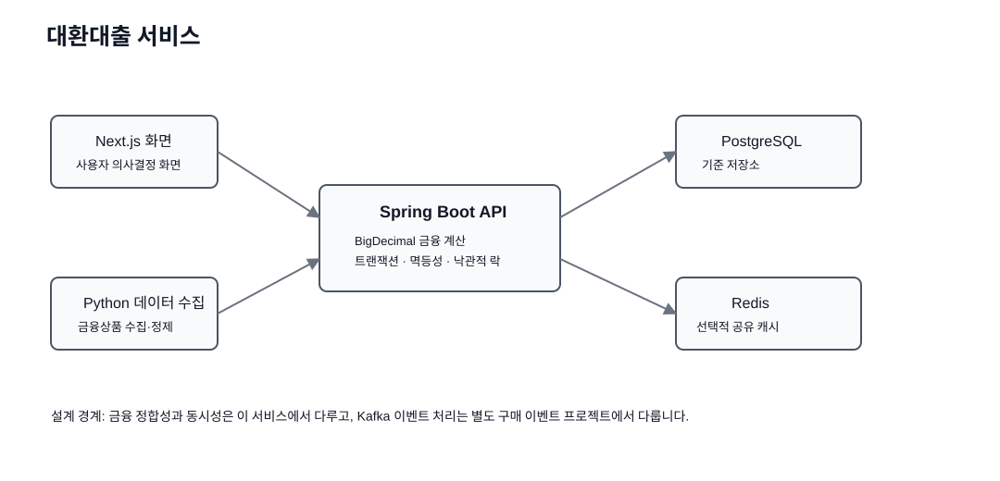

<div align="center">

# 대환대출 서비스

### 금융 계산 · 트랜잭션 · 낙관적 락 · 멱등성 · 캐시

대환대출 의사결정에 필요한 총비용 계산을 출발점으로, **정확한 금융 연산과 데이터 정합성, 동시성 제어를 함께 다루는 Java/Spring 백엔드 프로젝트**로 확장했습니다.


**기존 웹 데모** · https://pay-off-loan.vercel.app/

</div>

---

## 1. 프로젝트 핵심

처음 문제는 단순했습니다.

```text
현재 대출 금리 > 신규 대출 금리
→ 대환이 이득인가?
```

하지만 실제 판단에는 다음 요소가 함께 필요합니다.

```text
현재 원금
+ 남은 이자
+ 중도상환수수료
+ 인지세 / 이전비용
+ 상환 방식
+ 남은 기간
= 실제 총비용
```

기존 프로젝트는 Next.js와 TypeScript/Big.js로 이 비용을 계산하고 Python 수집기로 금융상품 데이터를 가져오는 서비스였습니다.

Spring Boot 백엔드를 추가하면서 문제를 다음 순서로 확장했습니다.

```text
계산 결과가 정확한가?
  ↓
동시에 같은 금융상품을 수정하면 어떤 값이 남는가?
  ↓
데이터 수집기가 응답을 받지 못해 같은 요청을 다시 보내면 중복 저장되지 않는가?
  ↓
조회가 많아졌을 때 캐시는 어디에 두어야 하는가?
  ↓
DB 트랜잭션과 외부 I/O의 경계는 어디여야 하는가?
```

이 프로젝트의 우선순위는 다음과 같습니다.

1. **계산 정확성** — 금융 계산에서 소수점 오차를 줄이기
2. **데이터 정합성** — 동시 갱신에서 갱신 손실 막기
3. **재시도 안전성** — 같은 요청이 다시 와도 중복 결과를 만들지 않기
4. **성능과 정합성의 균형** — 조회 캐시를 적용하되 오래된 데이터 문제까지 함께 보기

프로젝트와 면접에서는 **문제 → 원인 → 대안 → 선택 → 단점 → 검증** 순서로 설명합니다.

---

## 2. 전체 구조

### 기존 구조

```text
Next.js 화면
  ↓
TypeScript 계산 로직
  ↓
Big.js 소수 계산
  ↓
Supabase / PostgreSQL
```

Python/Selenium 데이터 수집기는 웹 요청과 분리되어 있습니다.

```text
외부 금융상품 페이지
  ↓
Python 수집
  ↓
데이터 정제
  ↓
DB
  ↓
웹 서비스
```

### Spring Boot 백엔드 추가



```text
기존 Next.js 화면            Python 데이터 수집기
      │                           │
      └──────────┐     ┌──────────┘
                 ▼     ▼
               Spring Boot
                    │
        ┌───────────┼────────────┐
        │           │            │
     대출 계산    상품 관리      캐시
        │           │            │
        └────── PostgreSQL ── Redis(선택)
```

기존 화면과 데이터 수집 코드는 역사적 자산으로 보존합니다. Spring Boot는 금융 계산과 상품 관리의 서버 측 정합성을 다루기 위해 추가했습니다.

---

## 3. 왜 `BigDecimal`을 사용했는가

금융 계산에서 `double`은 이진 부동소수점 표현 때문에 일부 소수를 정확하게 표현하지 못할 수 있습니다.

```text
0.1 + 0.2
→ 이진 부동소수점에서는 정확한 0.3 표현과 차이가 생길 수 있음
```

금리, 월 상환액, 누적 이자, 수수료처럼 반복 계산이 많은 영역에서는 작은 오차도 결과 신뢰성에 영향을 줄 수 있습니다.

| 방식 | 장점 | 단점 |
|---|---|---|
| `double` | 빠르고 단순함 | 소수 표현 오차 가능 |
| 최소 화폐단위 `long` | 금액 연산 안정적 | 금리·비율 계산이 복잡해짐 |
| `BigDecimal` | 소수 정밀도와 반올림 규칙을 명시 가능 | 연산 방식과 반올림 정책을 직접 관리해야 함 |

Spring Boot에서는 금액과 금리를 `BigDecimal`로 처리합니다.

```text
원금
+ 이자
+ 중도상환수수료
+ 대환 비용
  ↓
대환 총비용
```

핵심은 `BigDecimal` 자체보다 **금융 계산 정확성을 기능이 아닌 필수 품질 조건으로 본 것**입니다.

---

## 4. 상환 방식 계산 구조

상환 방식에 따라 월별 원금과 이자 계산식이 달라집니다.

```text
RepaymentCalculator
       ▲
       │
 ┌─────┴────────────┐
 │                  │
원리금균등        원금균등
```

`RefinanceSimulationService`가 모든 계산식을 직접 가지고 있지 않고, 상환 방식에 맞는 계산기를 선택하도록 분리했습니다.

새로운 상환 방식이 추가될 때 거대한 `if-else`가 늘어나는 것을 줄이고 **서비스 흐름과 계산 정책의 변경 이유를 분리**하기 위한 구조입니다.

---

## 5. 주요 API

### 대환 시뮬레이션

```http
POST /api/v1/simulations
```

요청 예시:

```json
{
  "principal": 100000000,
  "currentAnnualRate": 0.055,
  "newAnnualRate": 0.042,
  "remainingMonths": 36,
  "earlyRepaymentFee": 700000,
  "migrationCost": 150000,
  "repaymentType": "EQUAL_PAYMENT"
}
```

결과는 현재 대출 총비용, 대환 후 총비용, 절감액, 추천 여부를 반환합니다.

추천은 임의 문구가 아니라 `savings > 0`이라는 계산 결과를 기준으로 합니다.

### 상품 조회

```http
GET /api/v1/products
```

상품 목록은 `@Cacheable("loan-product-list")` 대상으로 두고, 상품이 수정되거나 새로 들어오면 `@CacheEvict(allEntries = true)`로 캐시를 무효화합니다.

---

## 6. 멱등한 상품 적재

```http
POST /api/v1/products/imports
Idempotency-Key: crawl-2026-09-10-woori-001
```

네트워크 문제로 다음 상황이 생길 수 있습니다.

```text
데이터 수집기 요청
  ↓
서버 저장 성공
  ↓
응답이 돌아오기 전에 네트워크 오류
  ↓
수집기는 성공 여부를 알 수 없음
  ↓
같은 요청 재시도
```

멱등성이 없다면 같은 저장 작업이 두 번 실행될 수 있습니다.

```text
멱등성 키
  ↓
기존 처리 기록 확인
  ├─ 이미 있음 → 기존 결과 반환
  └─ 없음 → 상품 저장 + 처리 기록 저장
```

추가로 `(bank_name, product_name)`에 DB 유일성 제약조건을 둡니다.

### 왜 멱등성 키와 유일성 제약조건을 둘 다 사용하는가

```text
멱등성 키
→ 같은 논리적 요청의 재시도를 식별

유일성 제약조건
→ 서로 다른 요청이라도 같은 금융상품이 중복 저장되는 것을 최종 차단
```

서로 비슷해 보이지만 보호하는 대상이 다릅니다.

---

## 7. 동시 갱신과 갱신 손실

동시에 같은 상품 금리를 수정하면 다음 문제가 생길 수 있습니다.

```text
DB 금리 = 4.0%

요청 A가 4.0 읽음
요청 B가 4.0 읽음

A가 4.2 저장
B가 4.1 저장

최종값 = 4.1
→ A의 변경이 사라짐
```

이를 **갱신 손실**이라고 봅니다.

### 낙관적 락

`LoanProduct`에 JPA `@Version`을 사용합니다.

```text
id
bank_name
product_name
base_rate
version
```

클라이언트는 수정할 때 자신이 읽었던 `expectedVersion`을 함께 보냅니다.

```http
PATCH /api/v1/products/{id}/rate
```

현재 버전이 이미 바뀌었다면 HTTP 409를 반환합니다.

```text
요청이 알고 있는 버전 = 3
현재 DB 버전 = 4
  ↓
오래된 버전의 갱신 요청
  ↓
HTTP 409 Conflict
```

### 왜 비관적 락 대신 낙관적 락인가

상품 금리 수정은 조회에 비해 충돌 빈도가 낮다고 가정합니다.

충돌이 드물다면 매번 다른 요청을 기다리게 하는 것보다 일단 갱신을 시도하고 실제 충돌이 발생했을 때 다시 읽게 하는 방식이 적합합니다.

반대로 충돌이 매우 자주 발생하고 순차 실행 자체가 중요하다면 비관적 락을 다시 검토할 수 있습니다.

락의 종류는 취향이 아니라 **충돌 빈도와 충돌 시 실패 비용**을 기준으로 선택합니다.

---

## 8. 트랜잭션 경계

상품 적재에서는 다음 두 상태가 함께 저장되어야 합니다.

```text
loan_products
+
idempotency_records
```

한쪽만 저장되고 다른 쪽이 실패하면 다음 재시도에서 상태가 어긋날 수 있습니다. 따라서 두 DB 쓰기는 하나의 `@Transactional` 범위로 묶습니다.

반면 외부 데이터 수집 전체를 DB 트랜잭션 안에 넣지 않습니다.

```text
좋지 않은 방식
BEGIN
  외부 사이트 요청
  네트워크 대기
  DB 저장
COMMIT
```

이렇게 하면 DB 연결과 트랜잭션을 외부 I/O 시간만큼 오래 점유할 수 있습니다.

선택한 경계:

```text
외부 I/O
  ↓
검증 / 변환
  ↓
짧은 DB 트랜잭션
```

---

## 9. 캐시와 데이터 정합성

상품 목록은 읽기 비중이 높은 기능이므로 Spring Cache를 적용했습니다.

```text
서버 한 대
→ 프로세스 내부 캐시가 가장 단순하고 빠를 수 있음

서버 여러 대
→ 각 서버의 로컬 캐시가 서로 달라질 수 있음
→ 공유 캐시 후보로 Redis 검토
```

### Redis가 무조건 더 빠른 것은 아님

Redis는 네트워크 통신이 필요하므로 같은 프로세스 메모리 캐시보다 느릴 수도 있습니다.

Redis의 핵심 목적은 단순 속도보다 **여러 서버가 같은 캐시 상태를 공유해야 할 때 일관된 기준을 제공하는 것**입니다.

실험에서는 다음을 함께 봅니다.

- p50 / p95 지연시간
- DB 조회 횟수
- 캐시가 비어 있는 첫 조회 비용
- 캐시 무효화 이후 동작

---

## 10. 실험 설계

상세 계획: [`docs/EXPERIMENT_PLAN.md`](docs/EXPERIMENT_PLAN.md)

### 낙관적 락 실험

질문:

> 같은 버전을 기준으로 여러 요청이 동시에 수정하면 몇 건이 성공하고 몇 건이 409가 되는가?

측정:

```text
HTTP 200 개수
HTTP 409 개수
최종 version
최종 base rate
```

```bash
python experiments/optimistic_lock_probe.py --product-id 1 --version 0
```

### 캐시 실험

질문:

> 상품 목록 반복 조회에서 프로세스 내부 캐시와 Redis 공유 캐시는 어떤 비용 차이가 있는가?

측정:

```text
p50
p95
DB 조회 횟수
캐시 적중 여부
```

### 멱등성 재시도 실험

질문:

> 같은 `Idempotency-Key` 요청을 반복해도 DB에는 하나의 논리적 결과만 남는가?

측정하지 않은 성능 수치는 README 성과로 적지 않습니다.

---

## 11. DB 무결성

애플리케이션 입력 검증만으로 데이터 무결성을 끝내지 않습니다.

```text
입력 검증
  ↓
트랜잭션 규칙
  ↓
JPA 버전 검사
  ↓
유일성 / CHECK 제약조건
  ↓
PostgreSQL
```

Flyway로 DB 변경 이력을 코드와 함께 관리해 개발 환경과 배포 환경의 스키마 차이를 줄입니다.

---

## 12. 테스트

주요 테스트:

```text
EqualPrincipalCalculatorTest
→ 원금균등 계산 검증

RefinanceSimulationServiceTest
→ 현재 대출과 대환 후 총비용 비교
→ 절감액과 추천 결과 검증
```

GitHub Actions에서는 Java 17 환경에서 다음을 실행합니다.

```bash
cd backend
mvn -B verify
```

---

## 13. 기존 데이터 수집 파이프라인

기존 Python 수집 코드는 그대로 보존합니다.

```text
crawling/
├── bank_crawlers/
├── crawler.py
├── cleansing.py
├── supabase_client.py
└── main.py
```

웹 요청과 데이터 수집을 분리한 이유는 실행 특성이 다르기 때문입니다.

```text
웹 요청
→ 짧고 예측 가능한 응답시간이 중요

데이터 수집
→ 외부 사이트 지연, 실패, 재시도가 발생할 수 있음
```

향후 수집 결과를 Spring 상품 적재 API로 보내면 멱등성 처리를 실제 데이터 수집 흐름과 연결할 수 있습니다.

---

## 14. 기술별 역할

| 역할 | 기술 | 선택 이유 |
|---|---|---|
| 금융 백엔드 | Java 17 / Spring Boot | 트랜잭션과 서버 로직 |
| 소수 계산 | BigDecimal | 금융 계산 정밀도 |
| 데이터 저장 | PostgreSQL / JPA | 관계형 데이터 정합성 |
| DB 변경 이력 | Flyway | 스키마 버전 관리 |
| 동시 갱신 | JPA `@Version` | 낙관적 락으로 갱신 손실 방지 |
| 재시도 안전성 | 멱등성 기록 + 유일성 제약조건 | 중복 저장 방지 |
| 캐시 | Spring Cache / Redis | 읽기 최적화와 여러 서버 간 캐시 공유 비교 |
| 기존 화면 | Next.js / TypeScript | 사용자 의사결정 화면 |
| 기존 데이터 수집 | Python / Selenium | 외부 금융상품 수집 |
| 검증 | JUnit / Maven / GitHub Actions | 반복 가능한 서버 검증 |

---

## 15. 실행

```bash
cd backend
mvn spring-boot:run
```

테스트:

```bash
mvn test
```

전체 검증:

```bash
mvn verify
```

Redis 사용:

```bash
mvn spring-boot:run -Dspring-boot.run.profiles=redis
```

---

## 16. 현재 한계

1. 기존 Next.js 화면의 모든 요청이 Spring Boot API로 이전된 것은 아닙니다.
2. 동시에 같은 멱등성 키를 처음 저장하려는 경쟁 상황의 예외 처리는 더 명시적으로 다듬을 수 있습니다.
3. 캐시 성능은 실행 환경마다 직접 측정해야 합니다.
4. 데이터 수집 작업의 일정 실행과 재시도는 별도 대기열/작업 처리자로 완전히 분리하지 않았습니다.
5. 실제 은행의 모든 복잡한 수수료 정책을 포함한 상용 계산 엔진은 아닙니다.
6. 인증·인가와 관리자 권한 모델은 현재 범위에 포함하지 않았습니다.

---

## 17. 왜 Kafka를 넣지 않았는가

이 프로젝트의 핵심 문제는 다음과 같습니다.

```text
금융 계산 정확성
트랜잭션
동시 행 갱신
멱등한 저장
캐시 정합성
```

이벤트 재처리나 여러 소비자가 같은 이벤트를 독립적으로 처리해야 하는 요구가 뚜렷하지 않은 상태에서 Kafka를 넣으면 기술이 문제보다 앞서게 됩니다.

Kafka와 이벤트 기반 처리는 별도 `commerce-event-pipeline` 프로젝트에서 집중적으로 다룹니다.

---

## 18. 면접 답변 요약

> 대환대출 서비스에서는 먼저 금액 계산이 틀리지 않도록 `BigDecimal`을 사용했습니다. 이후 같은 상품을 동시에 수정할 때 갱신 손실이 생길 수 있어 JPA `@Version`으로 낙관적 락을 적용하고 오래된 버전의 수정 요청은 409로 반환했습니다. 데이터 수집기가 네트워크 오류로 같은 요청을 재시도할 수 있기 때문에 멱등성 키와 DB 유일성 제약조건으로 중복 저장을 막았습니다. 상품 조회에는 캐시를 적용했지만 Redis가 무조건 빠르다고 가정하지 않고 프로세스 내부 캐시와 공유 캐시의 비용을 p95 지연시간과 DB 조회 횟수로 비교하도록 했습니다.

### 자주 나오는 질문

- 왜 금융 계산에 `double` 대신 `BigDecimal`을 사용하는가?
- 외부 I/O를 DB 트랜잭션 안에 오래 두면 왜 문제인가?
- 낙관적 락과 비관적 락은 어떤 기준으로 선택하는가?
- HTTP 409는 어떤 상황에서 반환하는가?
- 멱등성과 유일성 제약조건은 어떤 차이가 있는가?
- Redis 캐시가 프로세스 내부 캐시보다 항상 빠른가?
- 캐시 무효화가 왜 어려운가?
- 데이터 수집을 사용자 웹 요청에서 분리한 이유는 무엇인가?
- 왜 Kafka를 이 프로젝트에 넣지 않았는가?

세부 답변은 [`docs/INTERVIEW_GUIDE.md`](docs/INTERVIEW_GUIDE.md)에 정리합니다.

---

## 설계 원칙

> **금융 서비스에서는 빠른 코드보다 먼저 틀리지 않는 코드가 필요하고, 동시성이 생기면 최종 상태가 왜 그렇게 되었는지 설명할 수 있어야 합니다.**

이 프로젝트는 **정확성 → 정합성 → 재시도 안전성 → 성능** 순서로 문제를 해결합니다.